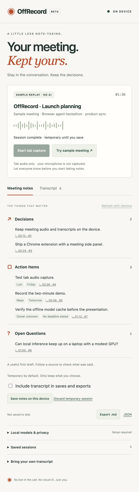

# OffRecord

**Your meeting. Kept yours.**

A Chrome extension that turns the audio already playing in your meeting tab into a local transcript, Decisions, Action Items, and Open Questions. Whisper transcribes on the CPU; Gemma 4 E2B reasons on the GPU. No bot joins the call, no account is required, and no meeting audio or transcript is sent to a cloud AI service.

OffRecord is an English-first hackathon prototype. Review generated notes against their linked source segments. See [verification](docs/VERIFICATION.md) for the exact tested behavior and remaining limits.



## Start in two minutes

Prerequisites: Node 20.19+ and current desktop Google Chrome. The extension APIs require Chrome 116+, but Gemma requires a current WebGPU-capable browser/GPU with `shader-f16`. Allow several GB of disk and GPU memory for models. The sample replay needs no models or GPU.

```sh
npm ci
npm run build
```

1. Visit `chrome://extensions`, enable **Developer mode**, click **Load unpacked**, and select this repository's `dist` folder.
2. Pin **OffRecord** in Chrome's extension menu.
3. Open a normal web page and click the OffRecord toolbar icon. Its side panel opens.
4. Click **Try sample meeting**. In about nine seconds, the panel shows 2 decisions, 3 actions, and 1 open question. This is a clearly labeled fixture replay, with no AI inference.
5. Click a source timestamp, reload the panel, or export Markdown/JSON. Sessions are temporary. Choose **Save notes on this device** to retain notes in Chrome's local IndexedDB. Check **Include transcript in saves and exports** only if you also want the full conversation retained.

The packaged extension ZIP is already built: unzip it and load its folder in the same way. You do not need Node for that route.

## Real local meeting capture

1. Open **Local models & privacy**. Leave downloads enabled and choose **Prepare local models**. First setup downloads public weights/configs from Hugging Face; it can take several minutes. No API key is needed.
2. Wait for **Speech: ready · Gemma: ready**. The model workers lock network downloads after setup. Keep this browser open for the demo so the models remain warm.
3. Open the meeting tab and click the OffRecord toolbar icon on **that tab**. Click **Start tab capture** in the panel. Let everyone know before taking notes.
4. Speak through the meeting's remote audio, or play the synthetic demo below. Transcripts arrive in roughly 12-second audio chunks, with one second of lookahead plus inference time. Gemma refreshes after every three new transcript segments, when available.
5. Click **Stop capture**. Capture tracks are released, accepted audio is drained, and Gemma processes the final transcript. Wait for **Session complete · temporary until you save**. Stopping does not automatically retain the meeting.
6. Review Decisions, Action Items, and Open Questions. Source links open the temporary transcript. Save notes on this device or export `.md`/JSON; the full transcript is excluded unless its checkbox is selected. Choose **Discard temporary session** to clear the in-memory copy.

**Tab audio excludes your own microphone on most meeting platforms.** This version intentionally does not request microphone permission. It captures the sound Chrome can capture from the selected tab; it cannot guarantee support for every meeting site, protected media, or internal Chrome pages. No platform-specific integration is needed for ordinary tab audio.

If speech setup succeeds but Gemma fails, capture can still produce a local transcript. Fix GPU/model setup, then use **Refresh with Gemma**. It never silently switches to cloud inference.

## Offline and local demo paths

### No-download sample replay

Click **Try sample meeting**, even without a network. Transcript and note fixtures replay locally. This proves the UI, storage, evidence links and exports, not model inference. Replay content lives in `src/demo.js`.

### Actual speech recognition and Gemma

```sh
npm run dev
```

Open **http://127.0.0.1:4173/meeting.html**. It serves a bundled 24-second synthetic meeting WAV from your own machine. Start the extension's capture on this tab, then press the audio player's Play button. The local test page never sends audio elsewhere. See [sample meeting script](docs/SAMPLE-MEETING.md).

To verify cached startup, close and reopen the test browser (same profile/extension), disable the network, uncheck **Allow model downloads during setup**, then **Prepare local models**. If the browser evicted a required file, setup fails visibly. Restore the network and prepare again before presenting. The model cache is not included in the release ZIP.

### Local text input

Expand **Bring your own transcript**, paste text, and load it into the temporary session. Once Gemma is ready, click **Refresh with Gemma**. This isolates local reasoning from audio capture. The browser preview at **http://127.0.0.1:4173/** supports replay and local text; tab capture requires the installed extension.

## Privacy in plain language

- Audio is processed in short in-memory buffers and never intentionally stored. The queue is bounded to five waiting chunks.
- Meeting content stays in memory by default. **Save notes on this device** stores notes and context in IndexedDB; retaining the transcript requires a separate checkbox. Saved data has no cloud sync or application-level encryption. Closing the browser loses unsaved meeting content; closing only the side panel does not stop the offscreen process.
- Only the selected tab's title/domain and first visible top-level heading are read after the user invokes the extension. URL paths/query parameters, attendee lists, screen video and private accounts are not collected.
- Public model assets download during explicit setup. Hugging Face/CDN infrastructure can see normal connection metadata such as your IP and requested model files. These requests do not contain meeting content.
- All executable JavaScript and WASM ship in the extension. There are no remote scripts, analytics, cloud AI APIs, backend services, or outbound follow-up actions.
- Exports are local files under your control. **Saved sessions → Delete selected session** removes that session from IndexedDB. Removing the extension clears its browser-managed storage; normal browser backups, exported files and OS storage protections remain outside OffRecord's control.

See [full privacy explanation](docs/PRIVACY.md) and [architecture](docs/ARCHITECTURE.md).

## Development and tests

```sh
npm test                       # pure logic, queue and lifecycle tests
npx playwright install chromium
npm run build
npm run test:e2e                # isolated browser, no model download
npm run check                  # tests + build + browser suite
node scripts/verify-models.mjs  # opt-in: headed Chromium + real model downloads
node scripts/verify-offline.mjs # same isolated profile, network disabled
node scripts/verify-capture.mjs # synthetic tab audio, same cached profile
```

The opt-in model verification uses a separate profile under `test-results`, never your personal browser. The capture test enables Chrome's extension-debugging test API only in that isolated profile to simulate clicking the toolbar action; it then disables networking for capture and inference. It may download multiple GB. Core/browser tests do not make cloud AI calls. Test doubles in lifecycle tests isolate the inference boundary; the opt-in test exercises the real models.

## Project map

- `src/background.js`: toolbar/side panel, active-tab context and stream ID.
- `src/offscreen.js`, `src/engine.js`: persistent processing lifecycle and command handling.
- `src/capture.js`, `src/audio-worklet.js`: tab audio, 16 kHz mono PCM and playback restoration.
- `src/model-worker.js`, `src/inference.js`, `src/models.js`: pinned local models, request guard, timeouts and workers.
- `src/core.js`, `src/storage.js`: validated evidence, note merging, exports and IndexedDB.
- `src/panel.js`, `public/`: the interface, sample replay and local audio practice page.
- `docs/`: architecture, privacy, scripts, final submission copy and verification.

## Known prototype limits

English-only small STT model; no speaker diarization; no microphone capture; chunk-level timestamps; fixed chunk boundaries can split words; no transcript editing; one active meeting. Notes use a rolling 24-segment window, so older notes may remain even if corrected much later. Evidence validation checks that IDs exist, not that every semantic inference is correct. There is no automatic task creation, question answering or sending messages. Keep meetings short for the hackathon demo.

If processing falls a minute behind, capture stops with a visible warning instead of growing an unbounded audio buffer. Browser crash/restart loses temporary meeting content; only explicitly saved notes/transcript survive. GPU/model generation errors preserve the last validated notes. Local storage is private to the extension origin, not protected against someone with access to your OS/browser profile.

## Submission kit

[Final title, tagline, description, social post and checklist](docs/SUBMISSION.md) · [Two-minute demo](docs/DEMO-SCRIPT.md) · [Sample meeting](docs/SAMPLE-MEETING.md).

Code is MIT licensed. Models and bundled libraries retain their own licenses; see [third-party notices](THIRD_PARTY_NOTICES.md). No model weights are redistributed in this repository. The project has not been published to the Chrome Web Store or submitted to the hackathon portal.

## Why not pgvector?

Chrome's IndexedDB is already on-device storage, not a cloud service. A local PostgreSQL + pgvector installation could support semantic search across a saved archive, but adds a separate database process and does not remove audio-access permissions or the sensitivity of saved notes. PGlite can run PostgreSQL in the browser, but still persists in browser-managed storage. This demo keeps retention opt-in and does not create embeddings or a searchable meeting archive.
