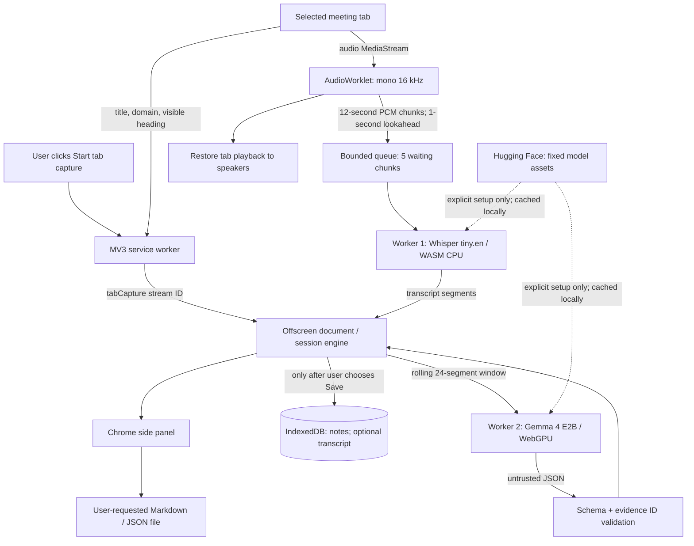

# OffRecord architecture

Audio/transcript never follows the model-download arrows out of the browser. Local model operations require no inference endpoint. The model receives data and returns candidate notes; it has no tools, network authority, or permission to act on another application.

## Lifecycle

The service worker opens the panel and creates one offscreen document. The offscreen engine owns audio, models, queues and persistence. The panel is a view/controller and can close independently. Chrome runtime messages carry commands and snapshots, not external network requests.

`ready → recording → stopping → complete`; fixture mode uses `replaying`. Stop flushes the AudioWorklet, releases audio tracks and AudioContext, drains accepted chunks, waits for generation, and finalizes the temporary state. Storage is written only after explicit retention. Interrupted browser sessions are marked as interrupted on recovery. A hard processing error preserves saved text and displays a warning.

## Models and packaging

The exact model commits are pinned in `src/models.js`. Speech uses Whisper tiny.en, q8, CPU/WASM; Gemma uses the text-only `Gemma4ForCausalLM` path in Transformers.js 4.2.0 with q4f16 WebGPU weights, loading the text embedding and decoder sessions. Vision/audio encoders are unnecessary for text reasoning. The worker's fixed URL template also pins v4 pipeline metadata preflight requests.

The pinned ONNX runtime's extended optimizer rejects the pinned Whisper QDQ decoder graph. Speech sessions explicitly disable graph optimization; local inference still executes the original graph. Model and end-to-end verification must confirm real transcription before a release.

esbuild bundles runtime code locally. WASM/runtime companion modules are copied into `dist/vendor`. CSP prohibits remote scripts and arbitrary network domains. `env.fetch` restricts model downloads to the configured model revision paths, GET/HEAD, without bodies or credentials; downloads are disabled after setup. Browser Cache Storage holds model assets; IndexedDB holds only explicitly retained meeting memory.

## Structured memory contract

Each transcript segment has a numeric ID, text, and start/end seconds. Notes have `text`, `evidence: number[]`, `owner: string | null`, and `due: string | null`, grouped into `decisions`, `actions`, `questions`. Model JSON must pass structural and evidence-ID validation before replacing notes. A single-field `{ "id": 1 }` source reference is normalized to numeric ID `1`; it still must name an existing segment. Up to 20 items/category are accepted; text is bounded. Rendering uses DOM text nodes.

Gemma refreshes after three new transcript segments, on Stop, or on request. It analyzes the most recent 24 segments. Prior notes grounded in that window are replaced, allowing corrections within the window. Older notes persist, with normalized exact-text deduplication. This is bounded meeting memory, not a comprehensive contradiction-resolution system.

## Primary implementation references

- [Chrome tab capture and offscreen stream IDs](https://developer.chrome.com/docs/extensions/how-to/web-platform/screen-capture)
- [Chrome sidePanel API](https://developer.chrome.com/docs/extensions/reference/api/sidePanel)
- [Chrome offscreen API](https://developer.chrome.com/docs/extensions/reference/api/offscreen)
- [Gemma 4 E2B ONNX model and inference examples](https://huggingface.co/onnx-community/gemma-4-E2B-it-ONNX)
- [Whisper tiny.en ONNX model](https://huggingface.co/onnx-community/whisper-tiny.en)
- [Transformers.js source, including text-only model architecture resolution](https://github.com/huggingface/transformers.js)

Implementation decisions were also checked against the installed pinned package source.
